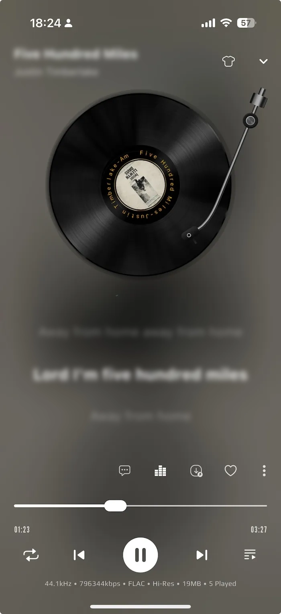

## 🎵 Amcfy Music — The Modern Subsonic-Compatible Music Player

**Amcfy Music** is a beautifully designed, high-performance **music player and Subsonic client** that connects seamlessly with **[Daoliyu Music](https://daoliyu.cn), [Songloft](https://github.com/songloft-org/songloft), [Subsonic](https://www.subsonic.org), [Navidrome](https://www.navidrome.org), [Jellyfin](https://jellyfin.org/), [Emby](https://emby.media/), [Plex](https://watch.plex.tv/)** servers.
Enjoy your entire music library with smooth streaming, smart offline caching, and full control over playback — all in a modern, elegant interface.

---

### ✨ Powerful Features for Every Music Lover

🎧 **Universal Music Access**
Browse and stream your collection by artists, albums, playlists, favorites, or folders.
Advanced search helps you instantly find any song across multiple servers.

⚡ **Smart Offline Cache**
Automatically stores the current and next tracks for **seamless playback**, even when your internet connection drops. Perfect for travel or limited network conditions.

🔊 **Pro Audio Controls**
Fine-tune your listening with **volume, pitch, and speed adjustment**.
Enjoy high-quality sound with a built-in **equalizer** for a fully customized audio experience.

🧠 **Sync & Playback Memory**
Amcfy Music remembers your last played track and syncs your progress with your music server — pick up exactly where you left off, on any device.

📝 **Lyrics & Metadata Support**
Displays both embedded lyrics and lyrics fetched from external APIs.
Enjoy rich metadata, album covers, and artist artwork automatically.

🎨 **Modern & Elegant UI**
A clean, fluid, and responsive interface designed for a **premium listening experience**.

🌍 **Internationalization Support**
Supports Simplified Chinese, Traditional Chinese, English, Japanese, and Korean, and provides [self-service translation](/i18n) for more languages.

---

### 🚗 Extra Features You’ll Love

* 🔄 One-tap switching between multiple servers
* 🚘 Car mode & landscape support for better accessibility
* 🎚️ Smooth **crossfade** transitions between songs
* 🌙 Screen stays on while playing music
* 💡 Local LAN streaming support

### 🌍 Why Choose Amcfy Music?

Whether you’re running your own Subsonic or Navidrome server, or managing a large local library, **Amcfy Music** offers a beautiful, reliable, and fully customizable listening experience.
It’s more than just a player — it’s the **perfect Subsonic-compatible music streaming app** for audiophiles who care about both **sound quality and design**.

---

💬 **Keywords:** Subsonic client, Navidrome player, Jellyfin music app, Emby music player, Swing Music, offline cache, streaming audio, equalizer, high-quality sound, audiophile player, music streaming app.
